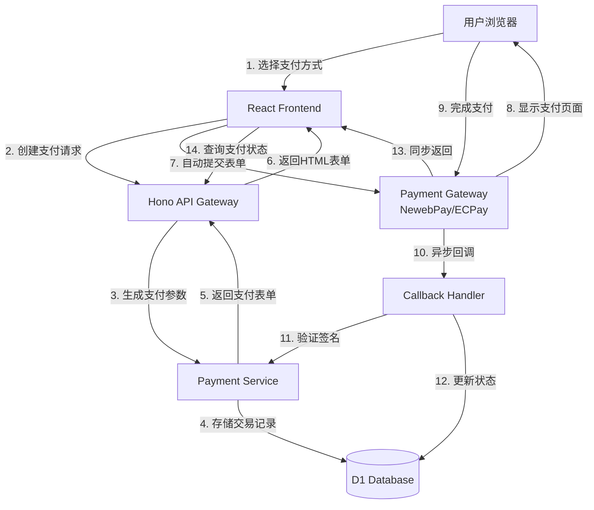

# Design Document: Taiwan Payment Gateway Integration

## Overview

本设计文档描述了在基于 Cloudflare Workers + Hono + D1 Database 的电商系统中集成台湾第三方支付网关的技术方案。系统将支持蓝新金流（NewebPay）和绿界科技（ECPay）两个主流支付服务商。

### 设计目标

1. 提供统一的支付接口抽象，支持多个支付网关
2. 确保支付流程的安全性和可靠性
3. 支持测试环境和生产环境的配置切换
4. 实现幂等的回调处理机制
5. 提供完整的交易记录和审计日志

### 技术栈

- 后端：Cloudflare Workers + Hono Framework
- 数据库：Cloudflare D1 (SQLite)
- 前端：React + TypeScript
- 加密：Web Crypto API (SHA256)
- HTTP客户端：fetch API

## Architecture

### 系统架构图




### 架构层次

1. **API Layer (Hono Routes)**
   - 处理HTTP请求和响应
   - 路由分发和中间件处理
   - 请求验证和错误处理

2. **Service Layer (Payment Service)**
   - 业务逻辑封装
   - 支付网关抽象接口
   - 签名生成和验证

3. **Gateway Adapter Layer**
   - NewebPay Adapter
   - ECPay Adapter
   - 统一的网关接口实现

4. **Data Layer (D1 Database)**
   - 交易记录持久化
   - 订单状态管理
   - 配置信息存储

5. **Security Layer**
   - 签名验证
   - 限流控制
   - 日志脱敏

## Components and Interfaces

### 1. Payment Gateway Interface

定义统一的支付网关接口，所有支付网关适配器必须实现此接口：

```typescript
interface PaymentGateway {
  // 网关名称
  name: string;
  
  // 创建支付请求
  createPayment(params: PaymentRequest): Promise<PaymentResponse>;
  
  // 验证回调签名
  verifyCallback(data: CallbackData): boolean;
  
  // 解析回调数据
  parseCallback(data: CallbackData): PaymentResult;
  
  // 查询支付状态
  queryPayment(transactionId: string): Promise<PaymentStatus>;
  
  // 发起退款
  refund(params: RefundRequest): Promise<RefundResponse>;
}

interface PaymentRequest {
  orderId: string;
  amount: number; // 以分为单位
  currency: string; // 'TWD'
  description: string;
  buyerEmail: string;
  paymentMethod: PaymentMethod;
  returnUrl: string;
  notifyUrl: string;
  expireDate?: Date;
}

interface PaymentResponse {
  success: boolean;
  transactionId: string;
  paymentUrl?: string;
  formHtml?: string;
  error?: string;
}

interface CallbackData {
  [key: string]: string;
}

interface PaymentResult {
  transactionId: string;
  orderId: string;
  amount: number;
  status: PaymentStatus;
  paidAt?: Date;
  gatewayTransactionId: string;
  paymentMethod: string;
}

enum PaymentStatus {
  PENDING = 'pending',
  PROCESSING = 'processing',
  SUCCESS = 'success',
  FAILED = 'failed',
  EXPIRED = 'expired',
  REFUNDED = 'refunded',
  CANCELLED = 'cancelled'
}

enum PaymentMethod {
  CREDIT_CARD = 'credit_card',
  ATM = 'atm',
  CONVENIENCE_STORE = 'cvs',
  BARCODE = 'barcode'
}
```


### 2. NewebPay Adapter

实现蓝新金流的支付网关适配器：

```typescript
class NewebPayAdapter implements PaymentGateway {
  name = 'NewebPay';
  
  constructor(
    private config: {
      merchantId: string;
      hashKey: string;
      hashIV: string;
      apiUrl: string;
      version: string;
    }
  ) {}
  
  async createPayment(params: PaymentRequest): Promise<PaymentResponse> {
    // 1. 构建交易数据
    const tradeInfo = {
      MerchantID: this.config.merchantId,
      RespondType: 'JSON',
      TimeStamp: Math.floor(Date.now() / 1000).toString(),
      Version: this.config.version,
      MerchantOrderNo: params.orderId,
      Amt: params.amount,
      ItemDesc: params.description,
      Email: params.buyerEmail,
      ReturnURL: params.returnUrl,
      NotifyURL: params.notifyUrl,
      CREDIT: params.paymentMethod === PaymentMethod.CREDIT_CARD ? 1 : 0,
      VACC: params.paymentMethod === PaymentMethod.ATM ? 1 : 0,
      CVS: params.paymentMethod === PaymentMethod.CONVENIENCE_STORE ? 1 : 0,
    };
    
    // 2. AES加密交易数据
    const tradeInfoEncrypted = this.aesEncrypt(
      JSON.stringify(tradeInfo),
      this.config.hashKey,
      this.config.hashIV
    );
    
    // 3. 生成检查码
    const tradeSha = this.generateCheckValue(tradeInfoEncrypted);
    
    // 4. 生成HTML表单
    const formHtml = this.generateForm({
      MerchantID: this.config.merchantId,
      TradeInfo: tradeInfoEncrypted,
      TradeSha: tradeSha,
      Version: this.config.version,
    });
    
    return {
      success: true,
      transactionId: params.orderId,
      formHtml,
    };
  }
  
  verifyCallback(data: CallbackData): boolean {
    const { TradeInfo, TradeSha } = data;
    const calculatedSha = this.generateCheckValue(TradeInfo);
    return calculatedSha === TradeSha;
  }
  
  parseCallback(data: CallbackData): PaymentResult {
    // 解密TradeInfo
    const decrypted = this.aesDecrypt(
      data.TradeInfo,
      this.config.hashKey,
      this.config.hashIV
    );
    const result = JSON.parse(decrypted);
    
    return {
      transactionId: result.MerchantOrderNo,
      orderId: result.MerchantOrderNo,
      amount: parseInt(result.Amt),
      status: this.mapStatus(result.Status),
      paidAt: result.PayTime ? new Date(result.PayTime) : undefined,
      gatewayTransactionId: result.TradeNo,
      paymentMethod: this.mapPaymentMethod(result.PaymentType),
    };
  }
  
  private generateCheckValue(tradeInfo: string): string {
    const str = `HashKey=${this.config.hashKey}&${tradeInfo}&HashIV=${this.config.hashIV}`;
    return this.sha256(str).toUpperCase();
  }
  
  private aesEncrypt(data: string, key: string, iv: string): string {
    // 使用Web Crypto API进行AES-256-CBC加密
    // 实现细节省略
    return '';
  }
  
  private aesDecrypt(data: string, key: string, iv: string): string {
    // 使用Web Crypto API进行AES-256-CBC解密
    // 实现细节省略
    return '';
  }
  
  private sha256(data: string): string {
    // 使用Web Crypto API进行SHA256哈希
    // 实现细节省略
    return '';
  }
  
  private mapStatus(status: string): PaymentStatus {
    // 映射NewebPay状态到系统状态
    return PaymentStatus.SUCCESS;
  }
  
  private mapPaymentMethod(type: string): string {
    // 映射NewebPay支付方式到系统支付方式
    return '';
  }
  
  private generateForm(params: any): string {
    // 生成自动提交的HTML表单
    return `
      <form id="payment-form" method="post" action="${this.config.apiUrl}">
        <input type="hidden" name="MerchantID" value="${params.MerchantID}">
        <input type="hidden" name="TradeInfo" value="${params.TradeInfo}">
        <input type="hidden" name="TradeSha" value="${params.TradeSha}">
        <input type="hidden" name="Version" value="${params.Version}">
      </form>
      <script>document.getElementById('payment-form').submit();</script>
    `;
  }
  
  async queryPayment(transactionId: string): Promise<PaymentStatus> {
    // 调用NewebPay查询API
    // 实现细节省略
    return PaymentStatus.PENDING;
  }
  
  async refund(params: RefundRequest): Promise<RefundResponse> {
    // 调用NewebPay退款API
    // 实现细节省略
    return { success: false };
  }
}
```


### 3. ECPay Adapter

实现绿界科技的支付网关适配器：

```typescript
class ECPayAdapter implements PaymentGateway {
  name = 'ECPay';
  
  constructor(
    private config: {
      merchantId: string;
      hashKey: string;
      hashIV: string;
      apiUrl: string;
    }
  ) {}
  
  async createPayment(params: PaymentRequest): Promise<PaymentResponse> {
    // 1. 构建交易数据
    const paymentData = {
      MerchantID: this.config.merchantId,
      MerchantTradeNo: params.orderId,
      MerchantTradeDate: this.formatDate(new Date()),
      PaymentType: 'aio',
      TotalAmount: params.amount.toString(),
      TradeDesc: params.description,
      ItemName: params.description,
      ReturnURL: params.notifyUrl,
      ClientBackURL: params.returnUrl,
      ChoosePayment: this.mapPaymentMethod(params.paymentMethod),
      EncryptType: 1,
    };
    
    // 2. 生成检查码
    const checkMacValue = this.generateCheckMacValue(paymentData);
    
    // 3. 生成HTML表单
    const formHtml = this.generateForm({
      ...paymentData,
      CheckMacValue: checkMacValue,
    });
    
    return {
      success: true,
      transactionId: params.orderId,
      formHtml,
    };
  }
  
  verifyCallback(data: CallbackData): boolean {
    const { CheckMacValue, ...params } = data;
    const calculatedMac = this.generateCheckMacValue(params);
    return calculatedMac === CheckMacValue;
  }
  
  parseCallback(data: CallbackData): PaymentResult {
    return {
      transactionId: data.MerchantTradeNo,
      orderId: data.MerchantTradeNo,
      amount: parseInt(data.TradeAmt),
      status: this.mapStatus(data.RtnCode),
      paidAt: data.PaymentDate ? new Date(data.PaymentDate) : undefined,
      gatewayTransactionId: data.TradeNo,
      paymentMethod: data.PaymentType,
    };
  }
  
  private generateCheckMacValue(params: any): string {
    // 1. 按照字母顺序排序参数
    const sortedKeys = Object.keys(params).sort();
    
    // 2. 组合参数字符串
    const paramStr = sortedKeys
      .map(key => `${key}=${params[key]}`)
      .join('&');
    
    // 3. 添加HashKey和HashIV
    const str = `HashKey=${this.config.hashKey}&${paramStr}&HashIV=${this.config.hashIV}`;
    
    // 4. URL编码
    const encoded = encodeURIComponent(str)
      .replace(/%20/g, '+')
      .toLowerCase();
    
    // 5. SHA256哈希
    return this.sha256(encoded).toUpperCase();
  }
  
  private sha256(data: string): string {
    // 使用Web Crypto API进行SHA256哈希
    // 实现细节省略
    return '';
  }
  
  private mapPaymentMethod(method: PaymentMethod): string {
    const map = {
      [PaymentMethod.CREDIT_CARD]: 'Credit',
      [PaymentMethod.ATM]: 'ATM',
      [PaymentMethod.CONVENIENCE_STORE]: 'CVS',
      [PaymentMethod.BARCODE]: 'BARCODE',
    };
    return map[method] || 'ALL';
  }
  
  private mapStatus(code: string): PaymentStatus {
    return code === '1' ? PaymentStatus.SUCCESS : PaymentStatus.FAILED;
  }
  
  private formatDate(date: Date): string {
    // 格式化为 yyyy/MM/dd HH:mm:ss
    return date.toISOString().replace('T', ' ').substring(0, 19);
  }
  
  private generateForm(params: any): string {
    const fields = Object.entries(params)
      .map(([key, value]) => `<input type="hidden" name="${key}" value="${value}">`)
      .join('\n');
    
    return `
      <form id="payment-form" method="post" action="${this.config.apiUrl}">
        ${fields}
      </form>
      <script>document.getElementById('payment-form').submit();</script>
    `;
  }
  
  async queryPayment(transactionId: string): Promise<PaymentStatus> {
    // 调用ECPay查询API
    // 实现细节省略
    return PaymentStatus.PENDING;
  }
  
  async refund(params: RefundRequest): Promise<RefundResponse> {
    // 调用ECPay退款API
    // 实现细节省略
    return { success: false };
  }
}
```


### 4. Payment Service

核心支付服务，协调各个组件：

```typescript
class PaymentService {
  private gateways: Map<string, PaymentGateway>;
  
  constructor(
    private db: D1Database,
    private config: PaymentConfig
  ) {
    this.gateways = new Map();
    this.initializeGateways();
  }
  
  private initializeGateways() {
    // 初始化NewebPay
    if (this.config.newebpay) {
      this.gateways.set('newebpay', new NewebPayAdapter(this.config.newebpay));
    }
    
    // 初始化ECPay
    if (this.config.ecpay) {
      this.gateways.set('ecpay', new ECPayAdapter(this.config.ecpay));
    }
  }
  
  async createPayment(
    gatewayName: string,
    params: PaymentRequest
  ): Promise<PaymentResponse> {
    // 1. 获取网关适配器
    const gateway = this.gateways.get(gatewayName);
    if (!gateway) {
      throw new Error(`Gateway ${gatewayName} not found`);
    }
    
    // 2. 验证订单金额
    await this.validateOrder(params.orderId, params.amount);
    
    // 3. 创建交易记录
    const transaction = await this.createTransaction({
      orderId: params.orderId,
      gateway: gatewayName,
      amount: params.amount,
      paymentMethod: params.paymentMethod,
      status: PaymentStatus.PENDING,
    });
    
    // 4. 调用网关创建支付
    const response = await gateway.createPayment({
      ...params,
      transactionId: transaction.id,
    });
    
    // 5. 更新交易记录
    if (response.success) {
      await this.updateTransaction(transaction.id, {
        gatewayTransactionId: response.transactionId,
        status: PaymentStatus.PROCESSING,
      });
    }
    
    return response;
  }
  
  async handleCallback(
    gatewayName: string,
    data: CallbackData
  ): Promise<{ success: boolean; message: string }> {
    // 1. 获取网关适配器
    const gateway = this.gateways.get(gatewayName);
    if (!gateway) {
      return { success: false, message: 'Gateway not found' };
    }
    
    // 2. 验证签名
    if (!gateway.verifyCallback(data)) {
      await this.logSecurityEvent('Invalid callback signature', { gatewayName, data });
      return { success: false, message: 'Invalid signature' };
    }
    
    // 3. 解析回调数据
    const result = gateway.parseCallback(data);
    
    // 4. 幂等性检查
    const existingTransaction = await this.getTransactionByOrderId(result.orderId);
    if (existingTransaction && existingTransaction.status === PaymentStatus.SUCCESS) {
      // 已经处理过，直接返回成功
      return { success: true, message: 'Already processed' };
    }
    
    // 5. 更新交易状态
    await this.updateTransactionByOrderId(result.orderId, {
      status: result.status,
      paidAt: result.paidAt,
      gatewayTransactionId: result.gatewayTransactionId,
    });
    
    // 6. 更新订单状态
    if (result.status === PaymentStatus.SUCCESS) {
      await this.updateOrderStatus(result.orderId, 'paid');
    } else if (result.status === PaymentStatus.FAILED) {
      await this.updateOrderStatus(result.orderId, 'payment_failed');
    }
    
    // 7. 记录回调日志
    await this.logCallback({
      gateway: gatewayName,
      orderId: result.orderId,
      status: result.status,
      data: JSON.stringify(data),
    });
    
    return { success: true, message: 'OK' };
  }
  
  async queryPaymentStatus(orderId: string): Promise<PaymentResult | null> {
    const transaction = await this.getTransactionByOrderId(orderId);
    if (!transaction) {
      return null;
    }
    
    return {
      transactionId: transaction.id,
      orderId: transaction.orderId,
      amount: transaction.amount,
      status: transaction.status,
      paidAt: transaction.paidAt,
      gatewayTransactionId: transaction.gatewayTransactionId,
      paymentMethod: transaction.paymentMethod,
    };
  }
  
  async refundPayment(
    orderId: string,
    amount: number,
    reason: string
  ): Promise<RefundResponse> {
    // 1. 获取原交易记录
    const transaction = await this.getTransactionByOrderId(orderId);
    if (!transaction || transaction.status !== PaymentStatus.SUCCESS) {
      return { success: false, error: 'Transaction not found or not paid' };
    }
    
    // 2. 验证退款金额
    if (amount > transaction.amount) {
      return { success: false, error: 'Refund amount exceeds payment amount' };
    }
    
    // 3. 获取网关适配器
    const gateway = this.gateways.get(transaction.gateway);
    if (!gateway) {
      return { success: false, error: 'Gateway not found' };
    }
    
    // 4. 调用网关退款
    const response = await gateway.refund({
      transactionId: transaction.gatewayTransactionId,
      amount,
      reason,
    });
    
    // 5. 记录退款
    if (response.success) {
      await this.createRefundRecord({
        transactionId: transaction.id,
        amount,
        reason,
        status: 'success',
      });
      
      // 如果是全额退款，更新交易状态
      if (amount === transaction.amount) {
        await this.updateTransaction(transaction.id, {
          status: PaymentStatus.REFUNDED,
        });
      }
    }
    
    return response;
  }
  
  // 数据库操作方法
  private async createTransaction(data: any): Promise<any> {
    // D1数据库插入操作
    return {};
  }
  
  private async updateTransaction(id: string, data: any): Promise<void> {
    // D1数据库更新操作
  }
  
  private async getTransactionByOrderId(orderId: string): Promise<any> {
    // D1数据库查询操作
    return null;
  }
  
  private async updateTransactionByOrderId(orderId: string, data: any): Promise<void> {
    // D1数据库更新操作
  }
  
  private async validateOrder(orderId: string, amount: number): Promise<void> {
    // 验证订单存在且金额匹配
  }
  
  private async updateOrderStatus(orderId: string, status: string): Promise<void> {
    // 更新订单状态
  }
  
  private async logCallback(data: any): Promise<void> {
    // 记录回调日志
  }
  
  private async logSecurityEvent(message: string, data: any): Promise<void> {
    // 记录安全事件
  }
  
  private async createRefundRecord(data: any): Promise<void> {
    // 创建退款记录
  }
}
```


### 5. API Routes (Hono)

定义HTTP API路由：

```typescript
import { Hono } from 'hono';
import { cors } from 'hono/cors';
import { rateLimiter } from './middleware/rate-limiter';

const app = new Hono();

// 中间件
app.use('*', cors());
app.use('/api/payment/*', rateLimiter({ max: 10, window: 60 }));

// 创建支付
app.post('/api/payment/create', async (c) => {
  const { orderId, gateway, paymentMethod } = await c.req.json();
  
  // 验证用户身份
  const user = await authenticateUser(c);
  
  // 获取订单信息
  const order = await getOrder(orderId, user.id);
  if (!order) {
    return c.json({ error: 'Order not found' }, 404);
  }
  
  // 创建支付
  const paymentService = new PaymentService(c.env.DB, getPaymentConfig(c.env));
  const response = await paymentService.createPayment(gateway, {
    orderId: order.id,
    amount: order.total,
    currency: 'TWD',
    description: `Order ${order.id}`,
    buyerEmail: user.email,
    paymentMethod,
    returnUrl: `${c.env.FRONTEND_URL}/payment/return`,
    notifyUrl: `${c.env.API_URL}/api/payment/callback/${gateway}`,
  });
  
  return c.json(response);
});

// 支付回调
app.post('/api/payment/callback/:gateway', async (c) => {
  const gateway = c.req.param('gateway');
  const data = await c.req.parseBody();
  
  const paymentService = new PaymentService(c.env.DB, getPaymentConfig(c.env));
  const result = await paymentService.handleCallback(gateway, data);
  
  if (result.success) {
    return c.text('1|OK'); // 返回格式根据网关要求
  } else {
    return c.text('0|' + result.message, 400);
  }
});

// 查询支付状态
app.get('/api/payment/status/:orderId', async (c) => {
  const orderId = c.req.param('orderId');
  const user = await authenticateUser(c);
  
  // 验证订单所有权
  const order = await getOrder(orderId, user.id);
  if (!order) {
    return c.json({ error: 'Order not found' }, 404);
  }
  
  const paymentService = new PaymentService(c.env.DB, getPaymentConfig(c.env));
  const status = await paymentService.queryPaymentStatus(orderId);
  
  return c.json(status);
});

// 退款
app.post('/api/payment/refund', async (c) => {
  const { orderId, amount, reason } = await c.req.json();
  
  // 验证管理员权限
  const user = await authenticateUser(c);
  if (!user.isAdmin) {
    return c.json({ error: 'Unauthorized' }, 403);
  }
  
  const paymentService = new PaymentService(c.env.DB, getPaymentConfig(c.env));
  const response = await paymentService.refundPayment(orderId, amount, reason);
  
  return c.json(response);
});

// 获取支付配置
function getPaymentConfig(env: any): PaymentConfig {
  return {
    newebpay: {
      merchantId: env.NEWEBPAY_MERCHANT_ID,
      hashKey: env.NEWEBPAY_HASH_KEY,
      hashIV: env.NEWEBPAY_HASH_IV,
      apiUrl: env.NEWEBPAY_API_URL,
      version: '2.0',
    },
    ecpay: {
      merchantId: env.ECPAY_MERCHANT_ID,
      hashKey: env.ECPAY_HASH_KEY,
      hashIV: env.ECPAY_HASH_IV,
      apiUrl: env.ECPAY_API_URL,
    },
  };
}

export default app;
```


### 6. Frontend Components (React)

支付相关的前端组件：

```typescript
// PaymentMethodSelector.tsx
interface PaymentMethodSelectorProps {
  onSelect: (gateway: string, method: string) => void;
}

export function PaymentMethodSelector({ onSelect }: PaymentMethodSelectorProps) {
  const [selectedGateway, setSelectedGateway] = useState('');
  const [selectedMethod, setSelectedMethod] = useState('');
  
  const gateways = [
    { id: 'newebpay', name: '蓝新金流', methods: ['credit_card', 'atm', 'cvs'] },
    { id: 'ecpay', name: '绿界科技', methods: ['credit_card', 'atm', 'cvs', 'barcode'] },
  ];
  
  const methodNames = {
    credit_card: '信用卡',
    atm: 'ATM转账',
    cvs: '超商代码',
    barcode: '超商条码',
  };
  
  return (
    <div className="payment-selector">
      <h3>选择支付方式</h3>
      
      {gateways.map(gateway => (
        <div key={gateway.id} className="gateway-option">
          <input
            type="radio"
            name="gateway"
            value={gateway.id}
            checked={selectedGateway === gateway.id}
            onChange={() => setSelectedGateway(gateway.id)}
          />
          <label>{gateway.name}</label>
          
          {selectedGateway === gateway.id && (
            <div className="payment-methods">
              {gateway.methods.map(method => (
                <button
                  key={method}
                  className={selectedMethod === method ? 'selected' : ''}
                  onClick={() => {
                    setSelectedMethod(method);
                    onSelect(gateway.id, method);
                  }}
                >
                  {methodNames[method]}
                </button>
              ))}
            </div>
          )}
        </div>
      ))}
    </div>
  );
}

// CheckoutPage.tsx
export function CheckoutPage() {
  const { orderId } = useParams();
  const [loading, setLoading] = useState(false);
  const [error, setError] = useState('');
  
  const handlePayment = async (gateway: string, method: string) => {
    setLoading(true);
    setError('');
    
    try {
      const response = await fetch('/api/payment/create', {
        method: 'POST',
        headers: { 'Content-Type': 'application/json' },
        body: JSON.stringify({ orderId, gateway, paymentMethod: method }),
      });
      
      const data = await response.json();
      
      if (data.success && data.formHtml) {
        // 将HTML表单插入页面并自动提交
        const container = document.createElement('div');
        container.innerHTML = data.formHtml;
        document.body.appendChild(container);
      } else {
        setError(data.error || '创建支付失败');
      }
    } catch (err) {
      setError('网络错误，请稍后重试');
    } finally {
      setLoading(false);
    }
  };
  
  return (
    <div className="checkout-page">
      <h2>订单结账</h2>
      <OrderSummary orderId={orderId} />
      <PaymentMethodSelector onSelect={handlePayment} />
      {loading && <div>处理中...</div>}
      {error && <div className="error">{error}</div>}
    </div>
  );
}

// PaymentReturnPage.tsx
export function PaymentReturnPage() {
  const { orderId } = useParams();
  const [status, setStatus] = useState<PaymentResult | null>(null);
  const [loading, setLoading] = useState(true);
  
  useEffect(() => {
    const checkStatus = async () => {
      try {
        const response = await fetch(`/api/payment/status/${orderId}`);
        const data = await response.json();
        setStatus(data);
      } catch (err) {
        console.error('Failed to check payment status', err);
      } finally {
        setLoading(false);
      }
    };
    
    checkStatus();
    
    // 每5秒轮询一次状态（最多轮询12次，共1分钟）
    const interval = setInterval(checkStatus, 5000);
    const timeout = setTimeout(() => clearInterval(interval), 60000);
    
    return () => {
      clearInterval(interval);
      clearTimeout(timeout);
    };
  }, [orderId]);
  
  if (loading) {
    return <div>查询支付状态中...</div>;
  }
  
  if (!status) {
    return <div>未找到支付记录</div>;
  }
  
  return (
    <div className="payment-return">
      {status.status === 'success' && (
        <div className="success">
          <h2>支付成功！</h2>
          <p>订单编号：{status.orderId}</p>
          <p>支付金额：NT$ {status.amount / 100}</p>
          <p>交易时间：{status.paidAt}</p>
        </div>
      )}
      
      {status.status === 'pending' && (
        <div className="pending">
          <h2>等待支付确认</h2>
          <p>您的支付正在处理中，请稍候...</p>
        </div>
      )}
      
      {status.status === 'failed' && (
        <div className="failed">
          <h2>支付失败</h2>
          <p>很抱歉，您的支付未能完成</p>
          <button onClick={() => window.location.href = `/checkout/${orderId}`}>
            重新支付
          </button>
        </div>
      )}
    </div>
  );
}
```


## Data Models

### 数据库Schema

```sql
-- 交易记录表
CREATE TABLE IF NOT EXISTS payment_transactions (
  id TEXT PRIMARY KEY,
  order_id TEXT NOT NULL,
  gateway TEXT NOT NULL, -- 'newebpay' or 'ecpay'
  gateway_transaction_id TEXT,
  amount INTEGER NOT NULL, -- 以分为单位
  currency TEXT DEFAULT 'TWD',
  payment_method TEXT NOT NULL,
  status TEXT NOT NULL, -- 'pending', 'processing', 'success', 'failed', 'expired', 'refunded', 'cancelled'
  created_at DATETIME DEFAULT CURRENT_TIMESTAMP,
  updated_at DATETIME DEFAULT CURRENT_TIMESTAMP,
  paid_at DATETIME,
  expired_at DATETIME,
  FOREIGN KEY (order_id) REFERENCES orders(id)
);

-- 回调日志表
CREATE TABLE IF NOT EXISTS payment_callbacks (
  id INTEGER PRIMARY KEY AUTOINCREMENT,
  transaction_id TEXT NOT NULL,
  gateway TEXT NOT NULL,
  callback_data TEXT NOT NULL, -- JSON格式
  status TEXT NOT NULL, -- 'success' or 'failed'
  error_message TEXT,
  created_at DATETIME DEFAULT CURRENT_TIMESTAMP,
  FOREIGN KEY (transaction_id) REFERENCES payment_transactions(id)
);

-- 退款记录表
CREATE TABLE IF NOT EXISTS payment_refunds (
  id TEXT PRIMARY KEY,
  transaction_id TEXT NOT NULL,
  amount INTEGER NOT NULL,
  reason TEXT,
  status TEXT NOT NULL, -- 'pending', 'success', 'failed'
  gateway_refund_id TEXT,
  created_at DATETIME DEFAULT CURRENT_TIMESTAMP,
  processed_at DATETIME,
  FOREIGN KEY (transaction_id) REFERENCES payment_transactions(id)
);

-- 安全事件日志表
CREATE TABLE IF NOT EXISTS payment_security_logs (
  id INTEGER PRIMARY KEY AUTOINCREMENT,
  event_type TEXT NOT NULL, -- 'invalid_signature', 'rate_limit', 'invalid_ip', etc.
  gateway TEXT,
  ip_address TEXT,
  user_agent TEXT,
  request_data TEXT,
  created_at DATETIME DEFAULT CURRENT_TIMESTAMP
);

-- 索引
CREATE INDEX idx_transactions_order_id ON payment_transactions(order_id);
CREATE INDEX idx_transactions_status ON payment_transactions(status);
CREATE INDEX idx_transactions_created_at ON payment_transactions(created_at);
CREATE INDEX idx_callbacks_transaction_id ON payment_callbacks(transaction_id);
CREATE INDEX idx_refunds_transaction_id ON payment_refunds(transaction_id);
```

### TypeScript类型定义

```typescript
interface PaymentTransaction {
  id: string;
  orderId: string;
  gateway: string;
  gatewayTransactionId?: string;
  amount: number;
  currency: string;
  paymentMethod: string;
  status: PaymentStatus;
  createdAt: Date;
  updatedAt: Date;
  paidAt?: Date;
  expiredAt?: Date;
}

interface PaymentCallback {
  id: number;
  transactionId: string;
  gateway: string;
  callbackData: string;
  status: string;
  errorMessage?: string;
  createdAt: Date;
}

interface PaymentRefund {
  id: string;
  transactionId: string;
  amount: number;
  reason?: string;
  status: string;
  gatewayRefundId?: string;
  createdAt: Date;
  processedAt?: Date;
}

interface PaymentSecurityLog {
  id: number;
  eventType: string;
  gateway?: string;
  ipAddress?: string;
  userAgent?: string;
  requestData?: string;
  createdAt: Date;
}

interface PaymentConfig {
  newebpay?: {
    merchantId: string;
    hashKey: string;
    hashIV: string;
    apiUrl: string;
    version: string;
  };
  ecpay?: {
    merchantId: string;
    hashKey: string;
    hashIV: string;
    apiUrl: string;
  };
}

interface RefundRequest {
  transactionId: string;
  amount: number;
  reason: string;
}

interface RefundResponse {
  success: boolean;
  refundId?: string;
  error?: string;
}
```


## Correctness Properties

*A property is a characteristic or behavior that should hold true across all valid executions of a system—essentially, a formal statement about what the system should do. Properties serve as the bridge between human-readable specifications and machine-verifiable correctness guarantees.*

### Property 1: Gateway Configuration Validation

*For any* payment gateway configuration (NewebPay or ECPay), if any required field (MerchantID, HashKey, HashIV) is missing, then gateway initialization SHALL fail with a descriptive error.

**Validates: Requirements 1.2, 1.3**

### Property 2: Invalid Credentials Prevention

*For any* payment operation attempted with invalid API credentials, the operation SHALL fail and log an appropriate error message without exposing sensitive credential information.

**Validates: Requirements 1.5**

### Property 3: Payment Method Validation

*For any* payment method selection, the system SHALL validate that the selected method is supported by the chosen gateway before proceeding with payment creation.

**Validates: Requirements 2.4**

### Property 4: Payment Gateway and Method Persistence

*For any* order with a selected payment gateway and method, querying the order SHALL return the same gateway and method values (round-trip property).

**Validates: Requirements 2.5**

### Property 5: Transaction ID Uniqueness

*For any* two payment initiations, the generated transaction identifiers SHALL be distinct.

**Validates: Requirements 3.1**

### Property 6: Payment Request Parameter Completeness

*For any* payment request, the generated parameters SHALL include all required fields specified by the gateway API (order information, amount, callback URLs).

**Validates: Requirements 3.2, 3.5, 3.6**

### Property 7: Signature Calculation Correctness

*For any* payment request to any gateway (NewebPay or ECPay), the calculated signature (CheckValue or CheckMacValue) SHALL be verifiable using the same algorithm and keys.

**Validates: Requirements 3.3, 3.4**

### Property 8: Transaction Record Creation

*For any* payment request creation, a transaction record SHALL be stored in the database with status "pending" and SHALL be retrievable by order ID (round-trip property).

**Validates: Requirements 3.7**

### Property 9: HTML Form Generation

*For any* payment request, the generated HTML form SHALL be valid HTML, contain all payment parameters as hidden fields, and include an auto-submit script.

**Validates: Requirements 4.1, 4.2, 4.5**

### Property 10: Gateway URL Routing

*For any* payment request, the form action URL SHALL match the selected gateway's payment endpoint (NewebPay URL for NewebPay, ECPay URL for ECPay).

**Validates: Requirements 4.3, 4.4**

### Property 11: Callback Signature Verification

*For any* payment callback from any gateway, signature verification SHALL be performed, and callbacks with invalid signatures SHALL be rejected.

**Validates: Requirements 5.1, 5.2, 5.3, 15.2**

### Property 12: Invalid Callback Rejection

*For any* callback with an invalid signature, the system SHALL reject the request, log a security warning, and NOT update any transaction or order status.

**Validates: Requirements 5.4**

### Property 13: Callback Idempotence

*For any* payment callback, processing it multiple times SHALL produce the same final state as processing it once (idempotence property).

**Validates: Requirements 5.6, 5.7**

### Property 14: Transaction Status Update

*For any* valid payment callback, the transaction status SHALL be updated to match the payment result, and the updated status SHALL be retrievable from the database.

**Validates: Requirements 5.8**

### Property 15: Order Status Synchronization

*For any* successful payment callback, the corresponding order status SHALL be updated to "paid".

**Validates: Requirements 5.9**

### Property 16: Callback Response Format

*For any* payment callback, the system SHALL return a response in the format expected by the gateway (success or failure indication).

**Validates: Requirements 5.10, 5.11**

### Property 17: Transaction Record Completeness

*For any* created transaction, all required fields (timestamp, amount, gateway, payment method, order ID, transaction ID) SHALL be stored in the database.

**Validates: Requirements 7.1, 7.2**

### Property 18: Status Change Timestamp

*For any* transaction status change, the updated_at timestamp SHALL be modified to reflect the change time.

**Validates: Requirements 7.3**

### Property 19: Callback Logging

*For any* payment callback received, a callback log record SHALL be created with timestamp, gateway, and callback data.

**Validates: Requirements 7.4**

### Property 20: Transaction Query Functionality

*For any* transaction record in the database, querying by order ID, date range, or status SHALL correctly return matching records.

**Validates: Requirements 7.5**

### Property 21: CSV Export Completeness

*For any* set of transaction records, the CSV export SHALL contain all transaction data in valid CSV format with proper headers.

**Validates: Requirements 7.7**

### Property 22: Payment Error Messaging

*For any* payment request failure, a descriptive error message SHALL be returned to the caller.

**Validates: Requirements 8.1**

### Property 23: Gateway Error Handling

*For any* error returned by a payment gateway, the system SHALL log the error details and return a user-friendly message (without exposing internal details).

**Validates: Requirements 8.3**

### Property 24: Duplicate Payment Prevention

*For any* order, multiple payment submission attempts within a short time window SHALL be prevented (only one pending payment allowed at a time).

**Validates: Requirements 8.4**

### Property 25: Environment-Specific Configuration

*For any* payment operation, the system SHALL use the API endpoints and credentials corresponding to the current environment (test endpoints for test mode, production endpoints for production mode).

**Validates: Requirements 9.2, 9.3**

### Property 26: Production Credentials Protection

*For any* system running in test environment, attempts to use production credentials SHALL be rejected.

**Validates: Requirements 9.5**

### Property 27: Payment Expiration Time

*For any* payment initiation, the expiration time SHALL be set according to the payment method (3 days for ATM/CVS, 30 minutes for credit card).

**Validates: Requirements 10.1, 10.2, 10.3**

### Property 28: Expired Payment Status Update

*For any* payment transaction past its expiration time, the status SHALL be updated to "expired".

**Validates: Requirements 10.4**

### Property 29: Refund Validation

*For any* refund request, the system SHALL validate that the original payment was successful before processing the refund.

**Validates: Requirements 11.1**

### Property 30: Refund Request Completeness

*For any* refund request, the request to the payment gateway SHALL include the original transaction identifier.

**Validates: Requirements 11.2**

### Property 31: Gateway-Specific Refund API

*For any* refund request, the system SHALL call the correct refund API for the gateway used in the original payment (NewebPay API for NewebPay payments, ECPay API for ECPay payments).

**Validates: Requirements 11.3, 11.4**

### Property 32: Refund Status Update

*For any* successful refund, the transaction status SHALL be updated to "refunded" and the order status SHALL be updated accordingly.

**Validates: Requirements 11.5, 11.6**

### Property 33: Partial Refund Support

*For any* refund amount less than the original payment amount, the system SHALL process it as a partial refund (where gateway supports it).

**Validates: Requirements 11.7**

### Property 34: Refund Record Creation

*For any* refund operation, a complete refund record SHALL be created with timestamp, amount, reason, and operator information.

**Validates: Requirements 11.8**

### Property 35: Amount Storage Format

*For any* payment amount, it SHALL be stored as a positive integer representing cents (smallest currency unit).

**Validates: Requirements 12.2, 12.4**

### Property 36: Amount Display Formatting

*For any* amount displayed to users, it SHALL be formatted with proper decimal places (dividing by 100 for TWD).

**Validates: Requirements 12.3**

### Property 37: Payment Amount Validation

*For any* payment request, the payment amount SHALL match the order total before the request is created.

**Validates: Requirements 12.5**

### Property 38: Amount Signature Protection

*For any* payment request, the amount SHALL be included in the signature calculation to prevent tampering.

**Validates: Requirements 12.6**

### Property 39: Multiple Payment Attempts

*For any* order, the system SHALL allow multiple payment attempts, creating a new transaction record for each attempt.

**Validates: Requirements 13.1, 13.2**

### Property 40: Transaction-Order Linking

*For any* transaction record, it SHALL be linked to its order, and querying all transactions for an order SHALL return all attempts.

**Validates: Requirements 13.3**

### Property 41: Pending Transaction Cancellation

*For any* order with a successful payment, all other pending transactions for that order SHALL be marked as "cancelled".

**Validates: Requirements 13.4**

### Property 42: Concurrent Payment Limit

*For any* order, the number of concurrent pending payments SHALL be limited to prevent abuse.

**Validates: Requirements 13.5**

### Property 43: Payment Initiation Logging

*For any* payment initiation, a log entry SHALL be created containing order ID, amount, gateway, and timestamp.

**Validates: Requirements 14.2**

### Property 44: Callback Logging Details

*For any* callback received, a log entry SHALL be created containing source IP, transaction ID, and processing result.

**Validates: Requirements 14.3**

### Property 45: API Call Logging

*For any* API call to a payment gateway, request and response details SHALL be logged.

**Validates: Requirements 14.4**

### Property 46: Sensitive Data Masking

*For any* log entry or error message, sensitive information (API keys, credit card numbers, passwords) SHALL be masked or redacted.

**Validates: Requirements 14.5, 15.7**

### Property 47: Credit Card Data Prohibition

*For any* payment transaction, credit card information SHALL NOT be stored in the database.

**Validates: Requirements 15.1**

### Property 48: Input Sanitization

*For any* input parameter received by payment endpoints, it SHALL be sanitized and validated before processing.

**Validates: Requirements 15.4**

### Property 49: Rate Limiting

*For any* user, payment endpoint requests SHALL be limited to a maximum of 10 requests per minute.

**Validates: Requirements 15.5**

### Property 50: Security Event Logging

*For any* security-related event (invalid signature, rate limit exceeded, invalid IP), a security log entry SHALL be created.

**Validates: Requirements 15.6**

### Property 51: CSRF Protection

*For any* payment initiation request, a valid CSRF token SHALL be required and validated.

**Validates: Requirements 15.8**

### Property 52: IP Whitelist Validation

*For any* callback request, the source IP address SHALL be validated against the known payment gateway IP addresses.

**Validates: Requirements 15.9**


## Error Handling

### Error Categories

1. **Configuration Errors**
   - Missing or invalid API credentials
   - Invalid environment configuration
   - Unsupported gateway or payment method

2. **Validation Errors**
   - Invalid payment amount (negative, zero, or exceeds order total)
   - Invalid order ID or order not found
   - Invalid payment method for selected gateway
   - Missing required parameters

3. **Gateway Errors**
   - Network timeout or connection failure
   - Gateway API returns error response
   - Invalid response format from gateway
   - Signature verification failure

4. **Business Logic Errors**
   - Order already paid
   - Payment already processed (duplicate)
   - Refund amount exceeds payment amount
   - Refund on non-successful payment

5. **Security Errors**
   - Invalid callback signature
   - Request from unauthorized IP address
   - Rate limit exceeded
   - CSRF token validation failure

### Error Handling Strategy

```typescript
class PaymentError extends Error {
  constructor(
    message: string,
    public code: string,
    public statusCode: number = 400,
    public details?: any
  ) {
    super(message);
    this.name = 'PaymentError';
  }
}

// Error codes
const ErrorCodes = {
  // Configuration
  INVALID_CREDENTIALS: 'INVALID_CREDENTIALS',
  GATEWAY_NOT_FOUND: 'GATEWAY_NOT_FOUND',
  
  // Validation
  INVALID_AMOUNT: 'INVALID_AMOUNT',
  ORDER_NOT_FOUND: 'ORDER_NOT_FOUND',
  INVALID_PAYMENT_METHOD: 'INVALID_PAYMENT_METHOD',
  
  // Gateway
  GATEWAY_TIMEOUT: 'GATEWAY_TIMEOUT',
  GATEWAY_ERROR: 'GATEWAY_ERROR',
  INVALID_SIGNATURE: 'INVALID_SIGNATURE',
  
  // Business Logic
  ORDER_ALREADY_PAID: 'ORDER_ALREADY_PAID',
  DUPLICATE_PAYMENT: 'DUPLICATE_PAYMENT',
  REFUND_AMOUNT_EXCEEDED: 'REFUND_AMOUNT_EXCEEDED',
  
  // Security
  UNAUTHORIZED: 'UNAUTHORIZED',
  RATE_LIMIT_EXCEEDED: 'RATE_LIMIT_EXCEEDED',
  CSRF_VALIDATION_FAILED: 'CSRF_VALIDATION_FAILED',
};

// Error handler middleware
app.onError((err, c) => {
  if (err instanceof PaymentError) {
    // Log error with context
    console.error({
      error: err.code,
      message: err.message,
      details: err.details,
      path: c.req.path,
      method: c.req.method,
    });
    
    // Return user-friendly error
    return c.json({
      error: err.code,
      message: err.message,
      // Don't expose internal details in production
    }, err.statusCode);
  }
  
  // Unexpected errors
  console.error('Unexpected error:', err);
  return c.json({
    error: 'INTERNAL_ERROR',
    message: 'An unexpected error occurred',
  }, 500);
});
```

### Retry Logic

```typescript
async function retryWithBackoff<T>(
  fn: () => Promise<T>,
  maxRetries: number = 3,
  baseDelay: number = 1000
): Promise<T> {
  let lastError: Error;
  
  for (let attempt = 0; attempt < maxRetries; attempt++) {
    try {
      return await fn();
    } catch (error) {
      lastError = error as Error;
      
      // Don't retry on validation errors
      if (error instanceof PaymentError && error.statusCode < 500) {
        throw error;
      }
      
      // Exponential backoff
      if (attempt < maxRetries - 1) {
        const delay = baseDelay * Math.pow(2, attempt);
        await new Promise(resolve => setTimeout(resolve, delay));
      }
    }
  }
  
  throw lastError!;
}
```

### Timeout Handling

```typescript
async function withTimeout<T>(
  promise: Promise<T>,
  timeoutMs: number,
  errorMessage: string = 'Operation timed out'
): Promise<T> {
  const timeoutPromise = new Promise<never>((_, reject) => {
    setTimeout(() => reject(new PaymentError(
      errorMessage,
      ErrorCodes.GATEWAY_TIMEOUT,
      504
    )), timeoutMs);
  });
  
  return Promise.race([promise, timeoutPromise]);
}

// Usage
const response = await withTimeout(
  gateway.createPayment(params),
  30000, // 30 seconds
  'Payment gateway request timed out'
);
```


## Testing Strategy

### Overview

本项目采用双重测试策略，结合单元测试和基于属性的测试（Property-Based Testing, PBT），以确保支付系统的正确性和可靠性。

- **单元测试**：验证特定示例、边缘情况和错误条件
- **属性测试**：验证跨所有输入的通用属性
- 两者互补，共同提供全面的测试覆盖

### Testing Framework

- **单元测试框架**: Vitest
- **属性测试库**: fast-check (TypeScript的property-based testing库)
- **最小迭代次数**: 每个属性测试至少100次迭代
- **标签格式**: `Feature: taiwan-payment-gateway, Property {number}: {property_text}`

### Property-Based Testing Configuration

```typescript
import { test, describe } from 'vitest';
import * as fc from 'fast-check';

// 配置fast-check
const fcConfig = {
  numRuns: 100, // 最少100次迭代
  verbose: true,
  seed: Date.now(), // 可重现的随机种子
};

// 自定义生成器
const arbitraries = {
  // 生成有效的订单ID
  orderId: () => fc.uuid(),
  
  // 生成有效的金额（1-1000000分，即0.01-10000元）
  amount: () => fc.integer({ min: 1, max: 1000000 }),
  
  // 生成支付方式
  paymentMethod: () => fc.constantFrom(
    PaymentMethod.CREDIT_CARD,
    PaymentMethod.ATM,
    PaymentMethod.CONVENIENCE_STORE,
    PaymentMethod.BARCODE
  ),
  
  // 生成网关名称
  gateway: () => fc.constantFrom('newebpay', 'ecpay'),
  
  // 生成email
  email: () => fc.emailAddress(),
  
  // 生成交易数据
  paymentRequest: () => fc.record({
    orderId: arbitraries.orderId(),
    amount: arbitraries.amount(),
    currency: fc.constant('TWD'),
    description: fc.string({ minLength: 1, maxLength: 100 }),
    buyerEmail: arbitraries.email(),
    paymentMethod: arbitraries.paymentMethod(),
  }),
};
```

### Test Organization

```
workers/src/tests/
├── unit/
│   ├── payment-service.test.ts
│   ├── newebpay-adapter.test.ts
│   ├── ecpay-adapter.test.ts
│   ├── callback-handler.test.ts
│   └── crypto-utils.test.ts
├── property/
│   ├── signature-properties.test.ts
│   ├── transaction-properties.test.ts
│   ├── callback-properties.test.ts
│   ├── refund-properties.test.ts
│   └── validation-properties.test.ts
├── integration/
│   ├── payment-flow.test.ts
│   └── callback-flow.test.ts
└── fixtures/
    ├── mock-gateways.ts
    └── test-data.ts
```

### Example Property Tests

#### Property 7: Signature Calculation Correctness

```typescript
describe('Property 7: Signature Calculation Correctness', () => {
  test('Feature: taiwan-payment-gateway, Property 7: For any payment request, signature should be verifiable', () => {
    fc.assert(
      fc.property(
        arbitraries.paymentRequest(),
        arbitraries.gateway(),
        (request, gatewayName) => {
          // Arrange
          const gateway = createGateway(gatewayName);
          
          // Act
          const response = gateway.createPayment(request);
          const signature = extractSignature(response);
          
          // Assert
          const isValid = gateway.verifySignature(signature, request);
          expect(isValid).toBe(true);
        }
      ),
      fcConfig
    );
  });
});
```

#### Property 13: Callback Idempotence

```typescript
describe('Property 13: Callback Idempotence', () => {
  test('Feature: taiwan-payment-gateway, Property 13: Processing callback multiple times produces same result', () => {
    fc.assert(
      fc.property(
        arbitraries.orderId(),
        fc.constantFrom('success', 'failed'),
        async (orderId, status) => {
          // Arrange
          const callbackData = createMockCallback(orderId, status);
          const service = new PaymentService(mockDb, config);
          
          // Act
          const result1 = await service.handleCallback('newebpay', callbackData);
          const result2 = await service.handleCallback('newebpay', callbackData);
          const result3 = await service.handleCallback('newebpay', callbackData);
          
          // Assert
          expect(result1).toEqual(result2);
          expect(result2).toEqual(result3);
          
          // Verify database state is same after multiple calls
          const transaction = await getTransaction(orderId);
          expect(transaction.status).toBe(status);
        }
      ),
      fcConfig
    );
  });
});
```

#### Property 27: Payment Expiration Time

```typescript
describe('Property 27: Payment Expiration Time', () => {
  test('Feature: taiwan-payment-gateway, Property 27: Expiration time matches payment method', () => {
    fc.assert(
      fc.property(
        arbitraries.paymentRequest(),
        async (request) => {
          // Arrange
          const service = new PaymentService(mockDb, config);
          
          // Act
          await service.createPayment('newebpay', request);
          const transaction = await getTransactionByOrderId(request.orderId);
          
          // Assert
          const expectedExpiration = calculateExpectedExpiration(request.paymentMethod);
          const actualExpiration = transaction.expiredAt;
          
          // Allow 1 second tolerance for execution time
          const diff = Math.abs(actualExpiration.getTime() - expectedExpiration.getTime());
          expect(diff).toBeLessThan(1000);
        }
      ),
      fcConfig
    );
  });
  
  function calculateExpectedExpiration(method: PaymentMethod): Date {
    const now = new Date();
    if (method === PaymentMethod.CREDIT_CARD) {
      return new Date(now.getTime() + 30 * 60 * 1000); // 30 minutes
    } else {
      return new Date(now.getTime() + 3 * 24 * 60 * 60 * 1000); // 3 days
    }
  }
});
```

### Example Unit Tests

#### Signature Calculation Edge Cases

```typescript
describe('NewebPay Signature Calculation', () => {
  test('should handle empty description', () => {
    const request = createPaymentRequest({ description: '' });
    const adapter = new NewebPayAdapter(config);
    
    const response = adapter.createPayment(request);
    expect(response.success).toBe(true);
    expect(response.formHtml).toContain('TradeSha');
  });
  
  test('should handle special characters in description', () => {
    const request = createPaymentRequest({ 
      description: '測試訂單 & <script>alert("xss")</script>' 
    });
    const adapter = new NewebPayAdapter(config);
    
    const response = adapter.createPayment(request);
    expect(response.success).toBe(true);
    // Verify special characters are properly encoded
  });
  
  test('should handle maximum amount', () => {
    const request = createPaymentRequest({ amount: 99999999 });
    const adapter = new NewebPayAdapter(config);
    
    const response = adapter.createPayment(request);
    expect(response.success).toBe(true);
  });
});
```

#### Callback Validation Edge Cases

```typescript
describe('Callback Signature Validation', () => {
  test('should reject callback with tampered amount', () => {
    const callback = createValidCallback();
    callback.Amt = '99999'; // Tamper with amount
    
    const adapter = new NewebPayAdapter(config);
    const isValid = adapter.verifyCallback(callback);
    
    expect(isValid).toBe(false);
  });
  
  test('should reject callback with missing signature', () => {
    const callback = createValidCallback();
    delete callback.TradeSha;
    
    const adapter = new NewebPayAdapter(config);
    const isValid = adapter.verifyCallback(callback);
    
    expect(isValid).toBe(false);
  });
  
  test('should accept valid callback', () => {
    const callback = createValidCallback();
    
    const adapter = new NewebPayAdapter(config);
    const isValid = adapter.verifyCallback(callback);
    
    expect(isValid).toBe(true);
  });
});
```

### Integration Tests

```typescript
describe('Payment Flow Integration', () => {
  test('complete payment flow: create -> callback -> query', async () => {
    // 1. Create payment
    const order = await createTestOrder();
    const response = await fetch('/api/payment/create', {
      method: 'POST',
      body: JSON.stringify({
        orderId: order.id,
        gateway: 'newebpay',
        paymentMethod: 'credit_card',
      }),
    });
    
    expect(response.status).toBe(200);
    const data = await response.json();
    expect(data.success).toBe(true);
    
    // 2. Simulate gateway callback
    const callback = createMockSuccessCallback(order.id);
    const callbackResponse = await fetch('/api/payment/callback/newebpay', {
      method: 'POST',
      body: new URLSearchParams(callback),
    });
    
    expect(callbackResponse.status).toBe(200);
    
    // 3. Query payment status
    const statusResponse = await fetch(`/api/payment/status/${order.id}`);
    const status = await statusResponse.json();
    
    expect(status.status).toBe('success');
    expect(status.orderId).toBe(order.id);
  });
});
```

### Test Coverage Goals

- **Line Coverage**: > 80%
- **Branch Coverage**: > 75%
- **Function Coverage**: > 85%
- **Critical Paths**: 100% (payment creation, callback handling, refund processing)

### Continuous Testing

- 所有测试在每次提交时自动运行
- 属性测试使用固定种子以确保可重现性
- 失败的属性测试会输出导致失败的具体输入值
- 集成测试使用独立的测试数据库

### Mock Strategy

```typescript
// Mock D1 Database
class MockD1Database {
  private data: Map<string, any[]> = new Map();
  
  async prepare(query: string) {
    return {
      bind: (...params: any[]) => ({
        all: async () => ({ results: [] }),
        first: async () => null,
        run: async () => ({ success: true }),
      }),
    };
  }
}

// Mock Payment Gateway
class MockPaymentGateway implements PaymentGateway {
  name = 'mock';
  
  async createPayment(params: PaymentRequest): Promise<PaymentResponse> {
    return {
      success: true,
      transactionId: params.orderId,
      formHtml: '<form></form>',
    };
  }
  
  verifyCallback(data: CallbackData): boolean {
    return data.signature === 'valid';
  }
  
  // ... other methods
}
```

